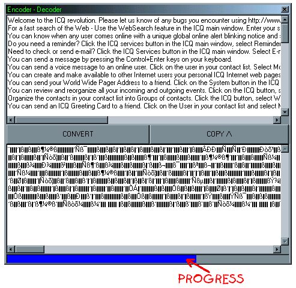



## \_\_\_\_\-=\(ENCODER/DECODER\)=\-\_\_\_\_\(UPDATED\)

### Description

Encoder/Decoder Updated, simple and fast text encoder and decoder with one simple function

also includes progressbar example
 
### More Info
 

             |
---                |---
**Submitted On**   |2001-07-07 14:04:02
**By**             |[Agent Smith](https://github.com/Planet-Source-Code/PSCIndex/blob/master/ByAuthor/agent-smith.md)
**Level**          |Intermediate
**User Rating**    |4.2 (92 globes from 22 users)
**Compatibility**  |VB 4\.0 \(32\-bit\), VB 5\.0, VB 6\.0
**Category**       |[Coding Standards](https://github.com/Planet-Source-Code/PSCIndex/blob/master/ByCategory/coding-standards__1-43.md)
**World**          |[Visual Basic](https://github.com/Planet-Source-Code/PSCIndex/blob/master/ByWorld/visual-basic.md)
**Archive File**   |[\_\_\_\_\-=\(ENC225637112001\.zip](https://github.com/Planet-Source-Code/agent-smith-encoder-decoder-updated__1-10992/archive/master.zip)

